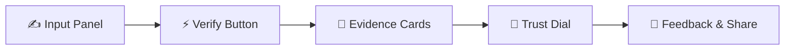
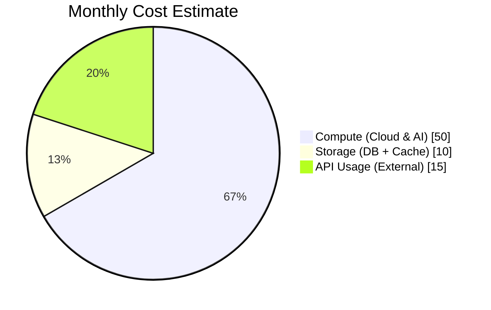

# ✨ 3NITY – VERIFIED TRUTH IN REAL-TIME  

> ⚡ Empowering clarity in a world clouded by misinformation  

---

## 🚩 Core Values – SPEED | TRUST | REACH  

<p align="center">
  <!-- Project Status & Tech Badges -->
  
  
  
  
  
</p>

## 🎯 Why 3NITY Exists  

Misinformation spreads faster than truth. 3NITY exists to **slow down the noise, speed up the facts**, and put **trust back into human conversation**.  

Paste a claim, upload a video, or snap a screenshot — within seconds, you see:  

✅ TRUST SCORE  
📊 SUPPORTING EVIDENCE  
❌ CONTRADICTIONS  
🌍 CROSS-SOURCE TRANSPARENCY  

---

<details>
<summary>🚀 Features</summary>

- 🌐 **Multi-modal input** – text, images, video  
- ⏱ **Real-time verification** – instant trust dial + score  
- 🔍 **Transparent evidence trail** – see *why* not just *what*  
- 🎨 **Neon-matte UI** – black canvas, glowing accents, cinematic animations  
- 🧩 **Modular AI** – easily pluggable ML/LLM upgrades  

</details>

---

<details>
<summary>🏗️ System Architecture (Flowchart)</summary>

```mermaid
flowchart TD
  subgraph FE["Frontend – React"]
    UI["Interactive UI"]
    UI --> API_Calls
  end

  subgraph BE["Backend – FastAPI"]
    API_Calls --> Routing
    Routing --> Auth
    Routing --> AIEngine
  end

  subgraph AIEngine["AI Verification Modules"]
    NLP["Text Embedding & NLP"]
    Vision["Image/Video Verification"]
    CrossCheck["Source Cross-Validation"]
    NLP --> CrossCheck
    Vision --> CrossCheck
  end

  subgraph DB["Database + Cache"]
    Facts["Trusted Sources"]
    Evidence["Evidence Store"]
  end

  CrossCheck --> DB
  DB --> CrossCheck

  FE --> BE
  BE --> FE
````

</details>

---

<details>
<summary>🛠️ Claim Verification Journey (Sequence Diagram)</summary>

```mermaid
sequenceDiagram
  actor U as User
  participant FE as Frontend
  participant BE as Backend
  participant AI as AI Modules
  participant DB as Database

  U->>FE: Submit claim (text/image/video)
  FE->>BE: API request
  BE->>AI: Generate embeddings & validate
  AI->>DB: Fetch & cross-check evidence
  DB-->>AI: Return relevant data
  AI->>BE: Ranked truth evidence
  BE->>FE: Verification results + score
  FE->>U: 🎯 Trust Dial + Evidence Cards
```

</details>

---

<details>
<summary>📐 UI Wireframe Flow</summary>



</details>

---

<details>
<summary>🎨 Visual Style Guide</summary>

| Element     | Style Example                               | Rationale                            |
| ----------- | ------------------------------------------- | ------------------------------------ |
| Background  | 🖤 Matte Black (#000000)                    | Minimal distraction, cinematic depth |
| Accent Neon | 💚 #10B981 (Truth), 🟧 #F59E0B (Warning)    | Intuitive meaning through color      |
| Fonts       | **Inter, Akidenz Grotesk**                  | Crisp, modern, high readability      |
| Motion      | `fadeInUp`, `pulseGlow`, `float` animations | Adds life without overwhelming       |
| Layout      | Dashboard-style modular cards               | Data clarity + aesthetic consistency |

</details>

---

<details>
<summary>📊 Cost & Ops Dashboard</summary>



| Expense Category | Monthly Estimate | Notes                       |
| ---------------- | ---------------- | --------------------------- |
| 🖥️ Compute      | \$50             | Cloud + AI processing power |
| 💾 Storage       | \$10             | Database, logs, caching     |
| 🌐 API Usage     | \$15             | Queries to external data    |

</details>

---

<details>
<summary>🔥 Setup & Run Instructions</summary>

```bash
# Frontend setup
cd frontend
npm install
npm start

# Backend setup
source .venv/bin/activate
uvicorn backend.main:app --reload
```

Access:

* Frontend → [http://localhost:3000](http://localhost:3000)
* API Docs → [http://localhost:8000/docs](http://localhost:8000/docs)

</details>

---

<details>
<summary>🎥 Demo (Coming Soon)</summary>

*Placeholder for embedded demo GIF or Loom video.*

</details>

---

## 🤝 Contributing

We’re building for **open, transparent truth-tech**.

* Fork & PRs welcome
* Open issues for features or bugs
* Join discussions around misinformation challenges

📧 [kamarajeshbabu@gmail.com](mailto:kamarajeshbabu@gmail.com)
🔗 [LinkedIn](https://www.linkedin.com/in/kamarajeshbabu)

---

## 📝 License

MIT License © 2025 Rajeshbabu Kama

---

## 🌌 Final Note

3NITY isn’t just a project.
It’s **a movement to make truth scalable**.

```ascii
   ╔══════════════════════╗
   ║   TRUST MADE REAL    ║
   ╚══════════════════════╝
```
